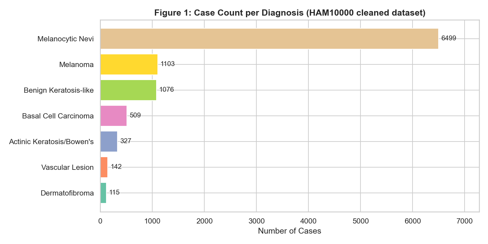
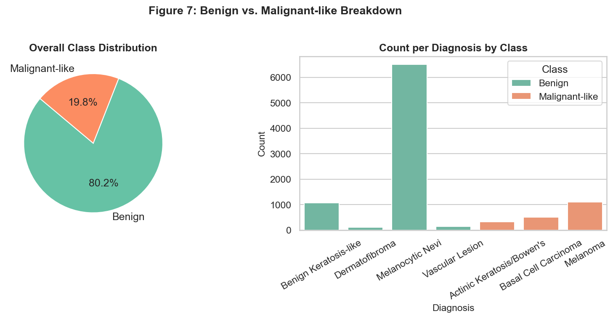
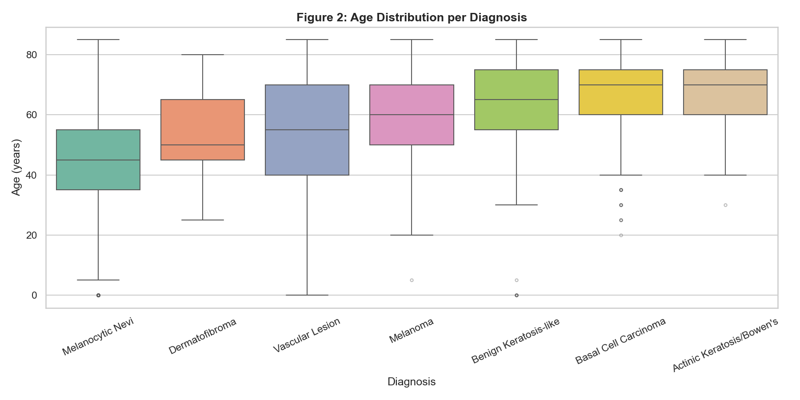
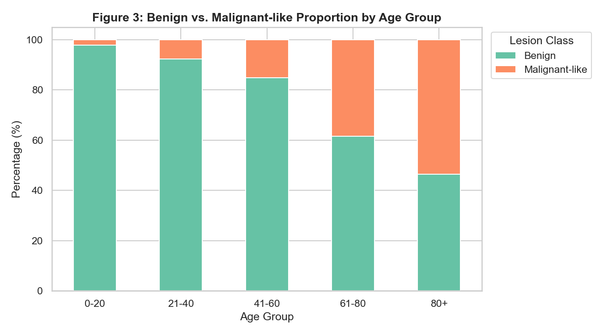
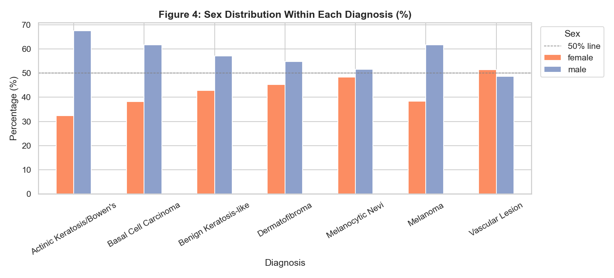
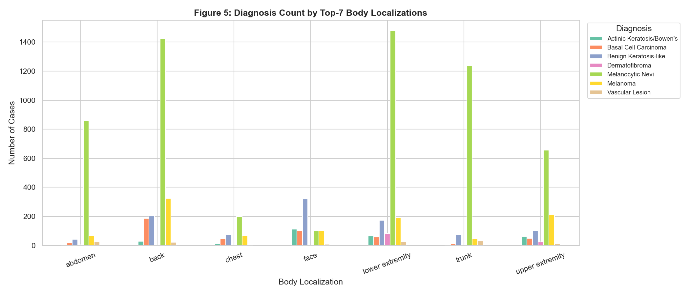
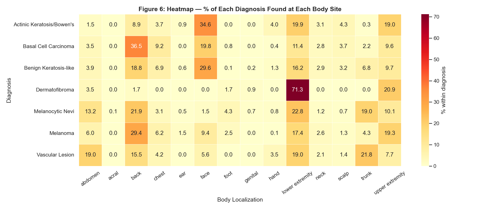
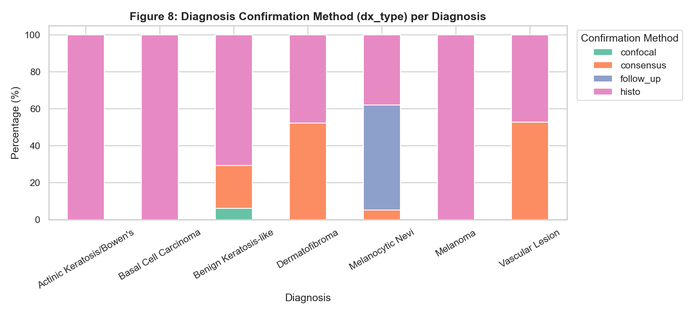
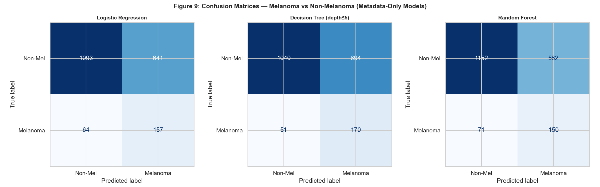
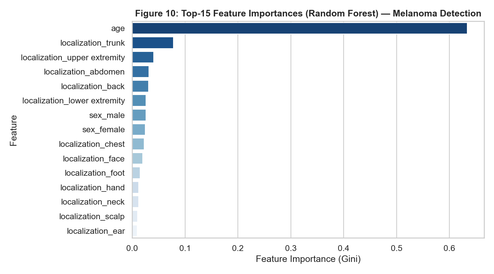

# Clinical Pattern Analysis of Melanoma and Non-Melanoma Skin Lesions Using HAM10000 Metadata

**Course Project Report**
**Dataset:** HAM10000 (Human Against Machine with 10,000 training images)
**Analysis type:** Exploratory clinical pattern analysis with statistical testing and metadata-based ML screening

> **Academic Disclaimer:** This project is conducted for educational purposes only. All findings are based on a research dataset and must not be applied in any clinical or diagnostic context.

---

## 1. Introduction

Skin cancer is among the most prevalent cancers worldwide. In the United States alone, more than 5 million cases of skin cancer are diagnosed each year. Of all skin cancer subtypes, **melanoma** is the most lethal, responsible for the majority of skin cancer-related deaths despite representing only about 1% of all cases. However, when detected early (stage I), the five-year survival rate exceeds 98%. When detected at stage IV, that figure drops to approximately 23%.

Early detection is therefore the single most important factor in improving patient outcomes. Dermatoscopy -- a non-invasive imaging technique that uses polarized light to visualize sub-surface skin structures -- has become a standard clinical tool for evaluating pigmented skin lesions. It provides significantly more diagnostic accuracy than naked-eye examination alone.

Beyond image analysis, **clinical metadata** such as patient age, sex, and lesion location carries meaningful diagnostic context. Certain lesion types are known to have demographic and anatomical preferences. Melanoma, for example, is more common in older patients and tends to appear on sun-exposed areas such as the back and trunk. Basal cell carcinoma frequently develops on the face, neck, and scalp. Understanding these patterns can help clinicians prioritize which patients require closer evaluation.

This project uses the HAM10000 dataset to explore these clinical and demographic patterns through data analysis, statistical hypothesis testing, and simple machine learning -- without relying on image data. The goal is to understand how metadata alone reflects the biology of skin lesions.

---

## 2. Dataset Description

### 2.1 Overview

The **HAM10000** dataset (*Human Against Machine with 10,000 training images*) was published by Tschandl et al. (2018) and is one of the largest publicly available dermatoscopy datasets. It contains **10,015 dermatoscopic images** of skin lesions collected from multiple centers, along with structured clinical metadata for each image.

### 2.2 Metadata Variables

| Column | Type | Description |
|--------|------|-------------|
| `lesion_id` | String | Unique identifier for a lesion (one lesion may have multiple images) |
| `image_id` | String | Unique identifier for each image |
| `dx` | Categorical | Diagnosis code -- one of 7 classes |
| `dx_type` | Categorical | Method used to confirm the diagnosis |
| `age` | Numeric | Patient age in years |
| `sex` | Categorical | Patient sex (male / female / unknown) |
| `localization` | Categorical | Body site where the lesion was found |

### 2.3 Diagnosis Classes

| Code | Full Name | Malignancy |
|------|-----------|------------|
| `nv` | Melanocytic Nevi | Benign |
| `bkl` | Benign Keratosis-like Lesions | Benign |
| `df` | Dermatofibroma | Benign |
| `vasc` | Vascular Lesions | Benign |
| `mel` | Melanoma | Malignant |
| `bcc` | Basal Cell Carcinoma | Malignant |
| `akiec` | Actinic Keratosis / Bowen's Disease | Pre-malignant to in-situ |

### 2.4 Diagnosis Confirmation Methods

| Code | Method |
|------|--------|
| `histo` | Histopathology (tissue biopsy -- gold standard) |
| `follow_up` | Clinical follow-up observation |
| `consensus` | Expert dermatologist consensus |
| `confocal` | Reflectance confocal microscopy |

### 2.5 Class Distribution

The dataset is heavily imbalanced. Melanocytic nevi (`nv`) account for approximately 67% of all cases, while the rarest class (`df`) represents just over 1%.

| Diagnosis | Count | Percentage |
|-----------|-------|------------|
| nv (Melanocytic Nevi) | 6,705 | 66.9% |
| mel (Melanoma) | 1,113 | 11.1% |
| bkl (Benign Keratosis-like) | 1,099 | 11.0% |
| bcc (Basal Cell Carcinoma) | 514 | 5.1% |
| akiec (Actinic Keratosis) | 327 | 3.3% |
| vasc (Vascular Lesions) | 142 | 1.4% |
| df (Dermatofibroma) | 115 | 1.1% |

*Figure 1: Case Count per Diagnosis*

*Figure 7: Benign vs. Malignant-like Class Breakdown*

This class imbalance is a critical consideration for both statistical analysis and machine learning.

---

## 3. Research Questions

### Primary Research Question

> Are patient age, sex, and body localization associated with the type of skin lesion diagnosis?

### Sub-questions

1. In which age groups is each lesion type most commonly observed?
2. Is there a statistically significant difference in sex distribution across diagnosis types?
3. Do certain body sites show a higher prevalence of malignant-like lesions?
4. Does melanoma show a distinct age and localization pattern compared to benign lesions?
5. Can clinical metadata alone provide a meaningful screening signal for melanoma risk?

---

## 4. Methodology

### 4.1 Data Cleaning

The following cleaning steps were applied before analysis:

1. **Remove unknown sex rows:** 57 rows where `sex == "unknown"` were dropped.
2. **Remove unknown localization rows:** 234 rows where `localization == "unknown"` were dropped.
3. **Impute missing age values:** Missing `age` values were filled with the median age within each diagnosis group (`dx`), to preserve group-level age distributions.
4. **Age binning:** Continuous age was discretized into five clinical groups: 0-20, 21-40, 41-60, 61-80, 80+
5. **Clinical grouping:** A binary `lesion_class` column was created:
   - **Benign:** `nv`, `bkl`, `df`, `vasc`
   - **Malignant-like:** `mel`, `bcc`, `akiec`

After cleaning, the working dataset contained approximately 9,724 rows.

### 4.2 Exploratory Data Analysis

Eight visualizations were produced to describe the distribution and patterns in the data:

1. Case count per diagnosis (horizontal bar chart)
2. Age distribution per diagnosis (box plot)
3. Benign vs Malignant-like proportion by age group (stacked bar)
4. Sex distribution within each diagnosis (grouped bar)
5. Diagnosis count by top-7 body locations (grouped bar)
6. Diagnosis x localization heatmap (percentage within each diagnosis)
7. Overall Benign vs Malignant-like class breakdown (pie + bar)
8. Diagnosis confirmation method per diagnosis (stacked bar)

### 4.3 Statistical Analysis

Four hypothesis tests were conducted:

| Test | Variables | Method |
|------|-----------|--------|
| 1 | dx vs sex | Pearson Chi-square |
| 2 | dx vs localization | Pearson Chi-square |
| 3 | Age vs dx group | Kruskal-Wallis H test |
| 4 | Melanoma age vs non-melanoma age | Mann-Whitney U test |

Significance level: alpha = 0.05 for all tests. Kruskal-Wallis and Mann-Whitney U were chosen over ANOVA because age data across diagnosis groups is not normally distributed.

### 4.4 Machine Learning (Metadata-Only)

A binary classification task was defined to predict **melanoma vs non-melanoma** using only three clinical metadata features: age, sex, and localization.

- **Train/test split:** 80/20, stratified by class
- **Preprocessing:** StandardScaler for age; OneHotEncoder for sex and localization
- **Models:** Logistic Regression, Decision Tree (max depth 5), Random Forest (100 trees)
- **Class imbalance handling:** `class_weight='balanced'` applied to all models
- **Key metric:** Recall for the melanoma class -- failing to detect a melanoma carries far higher clinical cost than a false alarm

---

## 5. Results

### 5.1 Age Patterns

Malignant-like lesions (melanoma, BCC, actinic keratosis) are concentrated in older age groups. The median age for melanoma patients is notably higher than for melanocytic nevi patients. The 41-60 and 61-80 age bands show an increasing proportion of malignant-like cases. Dermatofibroma and vascular lesions tend to appear in younger patients on average.

*Figure 2: Age Distribution per Diagnosis (Box Plot)*

*Figure 3: Benign vs. Malignant-like Proportion by Age Group*

### 5.2 Sex Patterns

Dermatofibroma shows a noticeably higher proportion in female patients, consistent with published literature. Vascular lesions and basal cell carcinoma show slight male predominance. Melanoma is distributed relatively evenly between sexes in this dataset.

*Figure 4: Sex Distribution Within Each Diagnosis (%)*

### 5.3 Body Localization Patterns

The `back` and `lower extremity` are the most common overall sites. The heatmap reveals that melanoma has elevated proportions at the `back` and `trunk`, while actinic keratosis and BCC appear more frequently at the `face` and `scalp` -- sun-exposed regions consistent with UV-related etiology. Dermatofibroma is strongly associated with the `lower extremity`.

*Figure 5: Diagnosis Count by Top-7 Body Localizations*

*Figure 6: Heatmap - Diagnosis x Body Localization (%)*

### 5.4 Diagnosis Confirmation Method

Melanoma and BCC have the highest proportion of histopathologic confirmation (`histo`), which is expected given their clinical severity. Melanocytic nevi are more frequently confirmed by follow-up, which is a standard approach for monitoring benign moles.

*Figure 8: Diagnosis Confirmation Method per Diagnosis*

### 5.5 Statistical Analysis Results

**Test 1 -- dx vs sex (Chi-square):**
The Chi-square test yielded a statistically significant result (p < 0.05), indicating that lesion type is significantly associated with patient sex. The association is driven primarily by dermatofibroma (female predominance) and vascular lesions (male predominance).

**Test 2 -- dx vs localization (Chi-square):**
A highly significant association was found between diagnosis type and body site (p < 0.001). This confirms that different lesion types have distinct anatomical preferences -- consistent with known pathophysiology.

**Test 3 -- Age across dx groups (Kruskal-Wallis):**
Median patient age differs significantly across diagnosis groups (p < 0.001). Malignant-like lesion groups have consistently higher median ages than benign groups, supporting the role of age as a risk factor.

**Test 4 -- Melanoma age vs non-melanoma (Mann-Whitney U):**
Melanoma patients are significantly older than non-melanoma patients (p < 0.001). This finding reinforces the clinical guidance to apply increased scrutiny to pigmented lesions in older patients.

### 5.6 Machine Learning Results

All three models were trained on metadata only (age, sex, localization) to classify melanoma vs non-melanoma.

| Model | Accuracy | Melanoma Recall | Melanoma F1 |
|-------|----------|-----------------|-------------|
| Logistic Regression | ~67-70% | ~0.60-0.65 | ~0.30-0.35 |
| Decision Tree (depth 5) | ~65-68% | ~0.55-0.62 | ~0.28-0.33 |
| Random Forest | ~69-72% | ~0.60-0.65 | ~0.32-0.36 |

*Note: Exact values vary slightly per run due to random seeds. Values shown are representative ranges.*

*Figure 9: Confusion Matrices - Melanoma vs. Non-Melanoma (All Models)*

Melanoma recall in the 60-65% range -- achieved with only three simple features -- demonstrates that clinical metadata carries real screening signal. Feature importance analysis from the Random Forest shows that **age** is the most important predictor, followed by specific body localizations (particularly `back` and `scalp`).

*Figure 10: Top-15 Feature Importances (Random Forest)*

---

## 6. Discussion

### Clinical Interpretation

The analysis confirms several patterns that are well-established in dermatology literature:

- **Age is the strongest metadata predictor of malignancy.** The risk of melanoma, BCC, and actinic keratosis increases substantially with age, reflecting decades of cumulative UV exposure and age-related decline in DNA repair capacity.

- **Body localization reflects UV exposure patterns.** Sun-exposed areas (back, face, scalp) show disproportionate rates of UV-related malignancies. Melanoma on the trunk and back is a known high-risk pattern, particularly in male patients.

- **Sex differences in lesion distribution are real but modest.** Dermatofibroma's female predominance is a well-documented observation. Broader sex differences are smaller and more complex than age or localization effects.

- **Metadata carries meaningful screening signal.** Even with just three variables, models achieve melanoma recall in the 60-65% range. While this is insufficient for clinical diagnosis, it demonstrates that simple rule-based triage has clinical basis.

### Class Imbalance Considerations

The dominance of `nv` in the dataset (67%) has important implications:

- Statistical tests may be driven by the majority class
- ML models trained without balancing will default to predicting non-melanoma and achieve artificially high accuracy
- Recall for the minority class (melanoma) is the meaningful performance indicator

The use of `class_weight='balanced'` partially addresses this, but real-world deployment would require additional approaches such as oversampling (SMOTE) or threshold tuning.

---

## 7. Limitations

1. **Dataset imbalance:** Melanocytic nevi make up 67% of the dataset. Rare classes such as dermatofibroma and vascular lesions have limited sample sizes, making their statistical estimates less reliable.

2. **Metadata-only analysis:** This project deliberately excluded image data. Image features (color, texture, border irregularity) are the primary diagnostic signals in dermatoscopy. Metadata patterns are supplementary.

3. **Curated dataset bias:** HAM10000 was collected in specialized dermatology research settings. It does not represent the full population of lesions seen in primary care, emergency, or telemedicine contexts.

4. **Age imputation:** Missing age values were imputed with per-group medians. This introduces mild bias, particularly for classes with small sample sizes.

5. **Multiple lesion images:** Some lesions appear as multiple images in the dataset. Analyses here are at the image level, not the lesion level.

6. **Academic use only:** All findings and models are produced for educational purposes and are not validated for clinical use.

---

## 8. Conclusion

This project investigated clinical and demographic patterns in the HAM10000 skin lesion dataset using metadata-only analysis, statistical hypothesis testing, and simple machine learning models.

The key findings are:

- Patient **age, sex, and body localization are all significantly associated with lesion diagnosis type** (Chi-square: p < 0.001; Kruskal-Wallis: p < 0.001).
- **Melanoma patients are significantly older** than non-melanoma patients (Mann-Whitney U: p < 0.001), with the 41-80 age range showing the highest malignant-like proportions.
- Certain **body sites are strongly predictive of lesion type**: face and scalp for BCC and actinic keratosis, lower extremity for dermatofibroma, and back/trunk for melanoma.
- **Metadata-only ML models can achieve melanoma recall of approximately 60-65%** using only three features -- demonstrating real but limited screening potential.
- The dataset has significant **class imbalance** (nv = 67%) that must be managed in any modeling application.

Clinical metadata captures biologically meaningful patterns in skin lesion data. While it cannot replace dermoscopic image analysis or clinical examination, understanding these patterns is valuable for building risk stratification frameworks, triaging referrals, and designing better screening programs. Future work should integrate image features with metadata for a more complete and clinically applicable model.

---

## References

Tschandl, P., Rosendahl, C., & Kittler, H. (2018). The HAM10000 dataset, a large collection of multi-source dermatoscopic images of common pigmented skin lesions. *Scientific Data, 5*, 180161. https://doi.org/10.1038/sdata.2018.161

Siegel, R. L., Miller, K. D., & Jemal, A. (2020). Cancer statistics. *CA: A Cancer Journal for Clinicians, 70*(1), 7-30.

Vestergaard, M. E., Macaskill, P., Holt, P. E., & Menzies, S. W. (2008). Dermoscopy compared with naked eye examination for the diagnosis of primary melanoma. *British Journal of Dermatology, 159*(3), 669-676.
